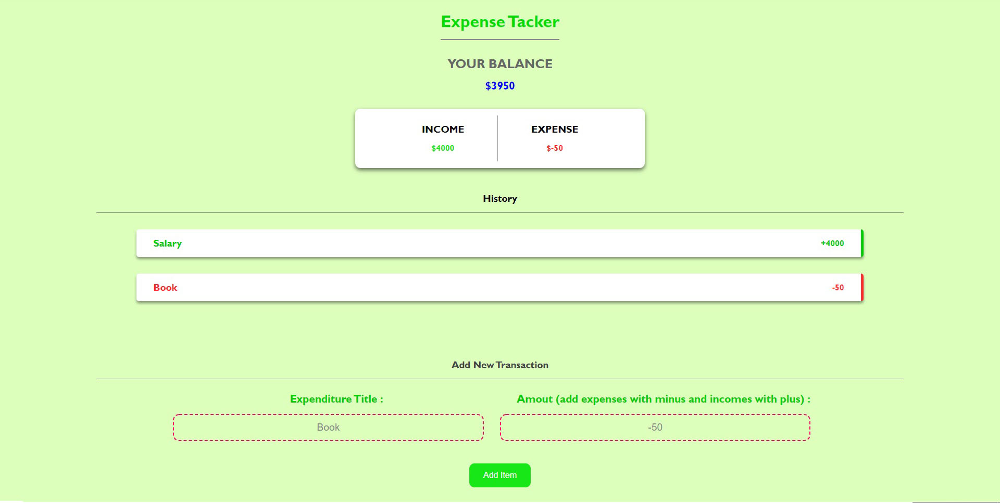

# Expense Tracker App 

# no **Framework** or Anything
## IT's completely **Responsive**
## I'm trying to Use No frameworks specially not for css
## and I think it's **super important** to have a good grasp of css and how it works 
## specially with grids, flexBox and positioning meaning **(relative, absolute, fixed)**
# data get saved in **localStorage** 
## Error Handling Feature
## ** quarantine production ** :))